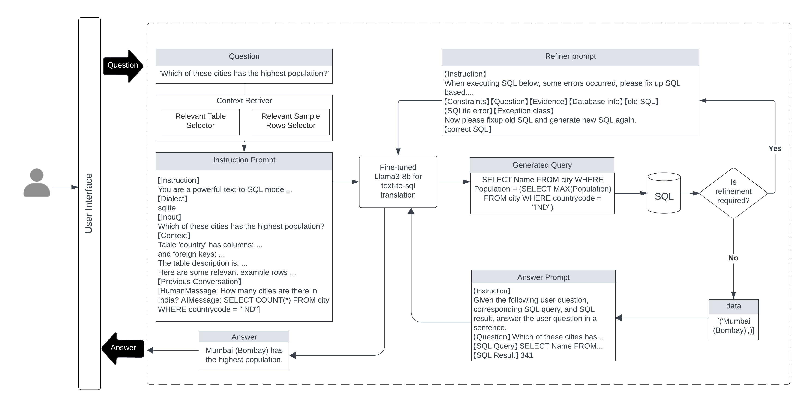
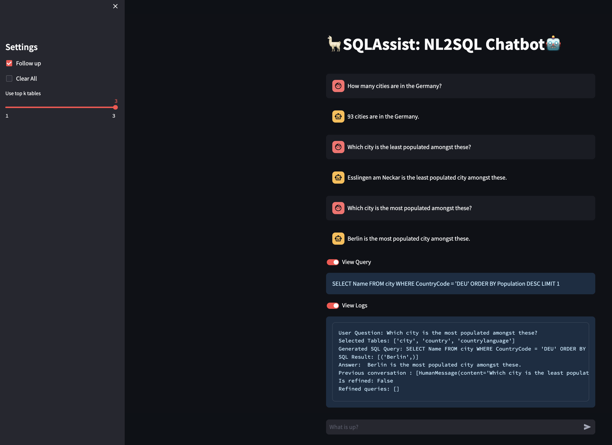

# 🤖SQLAssist: A RAG unified framework for Natural Language to SQL translation
Natural Language SQL Translator with following features and capabilities:

- Includes query-relevant context in instruction prompt
- Can answer follow-up questions using memory
- Refines SQL execution errors
- Rephrases answers for enhanced clarity




You can use our checkpoint to evaluation directly or finetune using our notebook on google colab.

1. Folder [core](core) contains code to the core modules of our framework.
2. Folder [db](db) contains the test db that the app uses and also the index files.
3. Folder [notebooks](notebooks) contains code to train, inference, evaluate and to run the application on Google Colab.
4. Folder [results](results) contains evaluation results.
5. Folder [utils](utils) contains templates and helper code.
6. Folder `static` contains files used in readme.
##
### Fine-tuning🔧

Google Colab notebooks are available at [notebooks](notebooks)
##
### Direct Evaluation📊

This evaluation script is tailored to assess the performance of our finetuned model across multiple complexity levels using metrics such as BLEU score and ROUGE score. We use text-to-sql datasets for easy, medium and hard complexities from [determined-ai](https://huggingface.co/determined-ai). The results are visulaized using box plots.

```python
python evaluation.py
```

Evaluation results are saved in `results` 
##
### SQLAssist application🌐

Start the SQLAssist application on Google Colab using [app.py](app.py)

To run it locally, 

```python
streamlit run app.py
```




