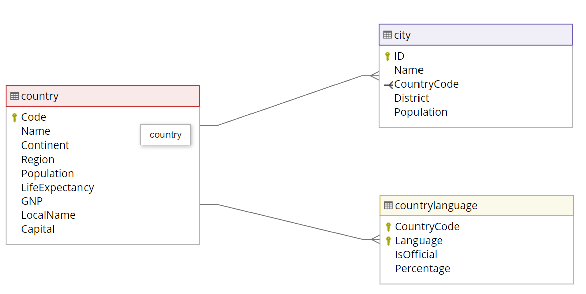

# Database
Our web application utilizes the WorldDB, which comprises three essential tables: city, country, and countrylanguage. 

### WorldDB
The WorldDB SQLite database is an open-source relational database management system renowned for its simplicity, ease of use, and exceptional portability, making it a popular choice across various industries. 

Here's the schema diagram:

